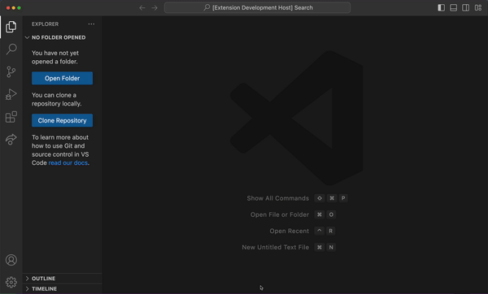

# jwt-vscode

A simple VS Code extension to decode JWT tokens.

## Instructions

1. Run `Decode JWT`.
2. The extension will prompt for the JWT, suggesting what's on your clipboard first
3. See the decoded token as a JSON in a unsaved file.

